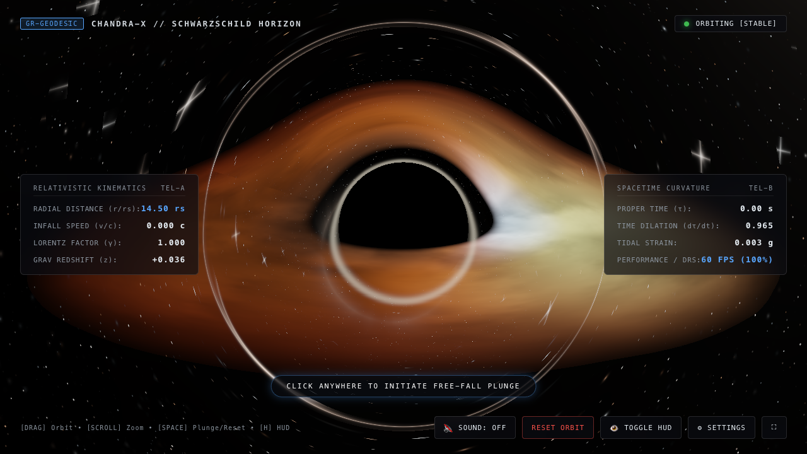

# Chandra-X // Relativistic Black Hole Simulation

A high-performance, single-page web application that simulates an authentic **Schwarzschild Black Hole** with general relativistic raymarching, gravitational lensing, an accretion disk with relativistic Doppler beaming, and interactive free-fall infall kinematics.



---

## Features

### 1. General Relativistic Raymarching (WebGL 2.0 / GLSL ES 3.00)
- **Null Geodesic Integration:** Real-time numerical integration of light ray paths in curved Schwarzschild spacetime:
  $$\frac{d^2\vec{x}}{d\lambda^2} = -\frac{3 M}{2 r^5} (\vec{x} \times \vec{v})^2 \vec{x}$$
- **Authentic Lensed Accretion Disk:** The back of the Keplerian accretion disk is gravitationally warped *over the top* and *under the bottom* of the black hole shadow (identical to Kip Thorne's *Interstellar* Gargantua simulation and EHT observations).
- **Relativistic Doppler Beaming ($D^4$):** Matter orbiting toward the observer is amplified in luminosity and blue-shifted to electric blue-white, while receding matter is dimmed and red-shifted to deep amber.
- **Photon Ring & Multiple Disk Images:** As light loops around $r \approx 1.5 R_s$, primary, secondary, and tertiary images naturally emerge.
- **Relativistic Aberration:** When plunging at relativistic speeds ($\beta = v/c \to 1$), incoming light is Lorentz-transformed, compressing the entire observable universe forward.
- **Pure Inky Black Cosmos:** True pitch-black deep space populated by razor-sharp pinpoint stars, realistic stellar color temperatures, and subtle diffraction spikes.

### 2. Interactive Gravitational Plunge (Click to Fall)
- **Click anywhere on the background** (or tap on touch screens) to trigger gravitational capture and free-fall.
- **Relativistic Timelike Geodesics:** The observer plunges towards the black hole under Schwarzschild acceleration:
  $$\frac{dr}{d\tau} = -c \sqrt{\frac{R_s}{r} - \frac{R_s}{R_0}}$$
- **Tidal Gravitational Strain:** Camera exhibits realistic tidal vibration/shake that intensifies as $r \to R_s$.
- **Horizon Breach & Singularity Collapse:** Crossing the event horizon ($r \le R_s$) triggers an inescapable plunge to the gravitational singularity with a relativistic whiteout flash.

### 3. Procedural Web Audio Engine (Zero Assets)
- 100% procedural sound synthesis using the native Web Audio API (zero audio files to download, zero latency, zero 404 errors):
  - **Binaural Sub-Bass Drone:** Detuned 43.65 Hz & 44.20 Hz fundamental sine waves.
  - **Accretion Disk Turbulence:** Modulated filtered noise reflecting Keplerian gas shear.
  - **Infall Acceleration:** Doppler pitch ascent during plunge.
  - **Horizon Crossing Pulse:** Sub-bass seismic boom upon crossing $R_s$.

### 4. Production-Grade SRE & Developer Architecture
- **Dynamic Resolution Scaling (DRS):** Automatically monitors rolling frame budget (target 60 FPS) and adapts internal render scale to sustain smooth performance.
- **Page Visibility API:** Automatically halts rendering loops when the browser tab is hidden to save GPU cycles and battery.
- **WebGL Context Recovery:** Automatic handling of `webglcontextlost` and `webglcontextrestored` events.
- **Zero-Build Portability:** Pure ES6 modules with no compile or bundler requirements. Can be served via any static HTTP server.

---

## How to Run

### Quick Start with Python
```bash
python3 -m http.server 3000
```
Open [http://localhost:3000](http://localhost:3000) in your browser.

### Or with Node.js
```bash
npm run serve
```
Open [http://localhost:3000](http://localhost:3000).

---

## Controls

| Action | Control | Description |
| :--- | :--- | :--- |
| **Infall Plunge** | **Left Click** / **Spacebar** | Initiates relativistic free-fall into the black hole. |
| **Orbit Camera** | **Click & Drag** | Rotate azimuthal and elevation view around the black hole. |
| **Zoom Orbit** | **Scroll Wheel** / **Pinch** | Move observer closer or farther from the black hole. |
| **Reset Orbit** | **Reset Button** / **Spacebar** | Ejects observer safely back to stable orbit ($r = 14.5 R_s$). |
| **Toggle Audio** | **M Key** / **Audio Button** | Toggles procedural space audio on/off. |
| **Toggle HUD** | **H Key** / **HUD Button** | Hides/shows the telemetry dashboard for clean screenshots. |
| **Fullscreen** | **F Key** / **Fullscreen Button** | Toggles browser fullscreen mode. |
| **Settings** | **⚙ Button** / **ESC to close** | Adjust disk intensity, lensing factor, infall rate, and FOV. |

---

## Technical Stack
- **Graphics:** WebGL 2.0, GLSL ES 3.00
- **Audio:** Web Audio API (procedural oscillators and noise buffers)
- **Math:** Analytical Schwarzschild metric geodesics, Lorentz transformations
- **Styles:** Responsive CSS Grid/Flexbox, Glassmorphism, Monospace telemetry UI
